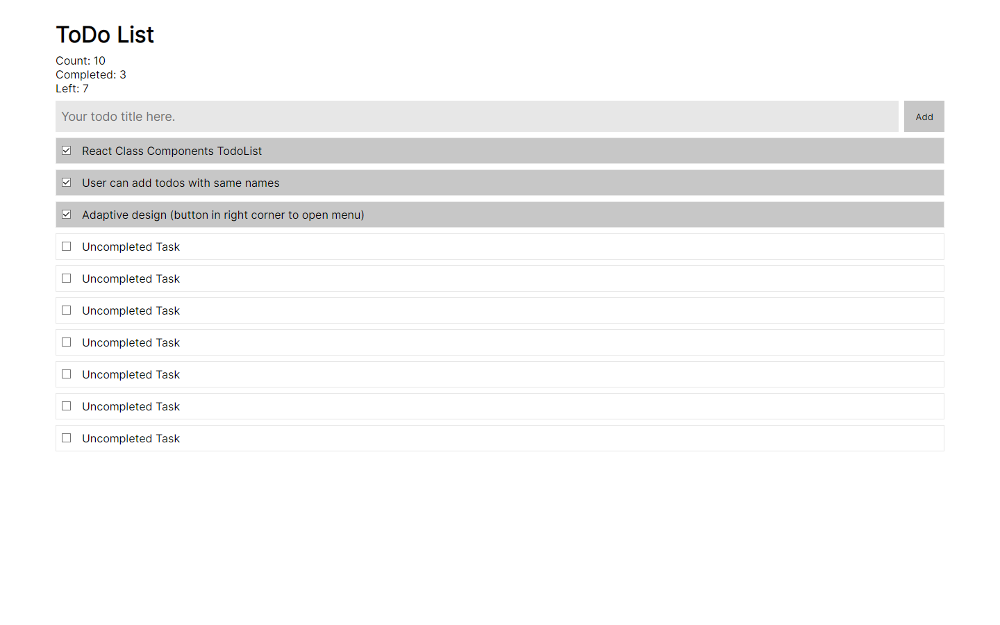

# React Todo App

This project is basic example of todo list.

## Preview on Desktop

## Technologies

- React
- React Class Components

## Project Features

- Creating todos with any name
- You may delete todo (both completed & uncompleted)
- Count of completed/uncompleted tasks

## Local install

### Pre-requirements:

- Node and NPM installed on your device

### Installation

- Clone this repository
- Run `npm install` in cloned folder
- Run `npm start` or `npm start` to start project locally
